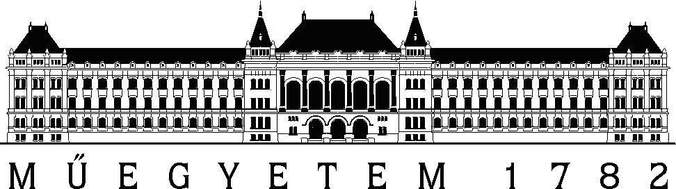
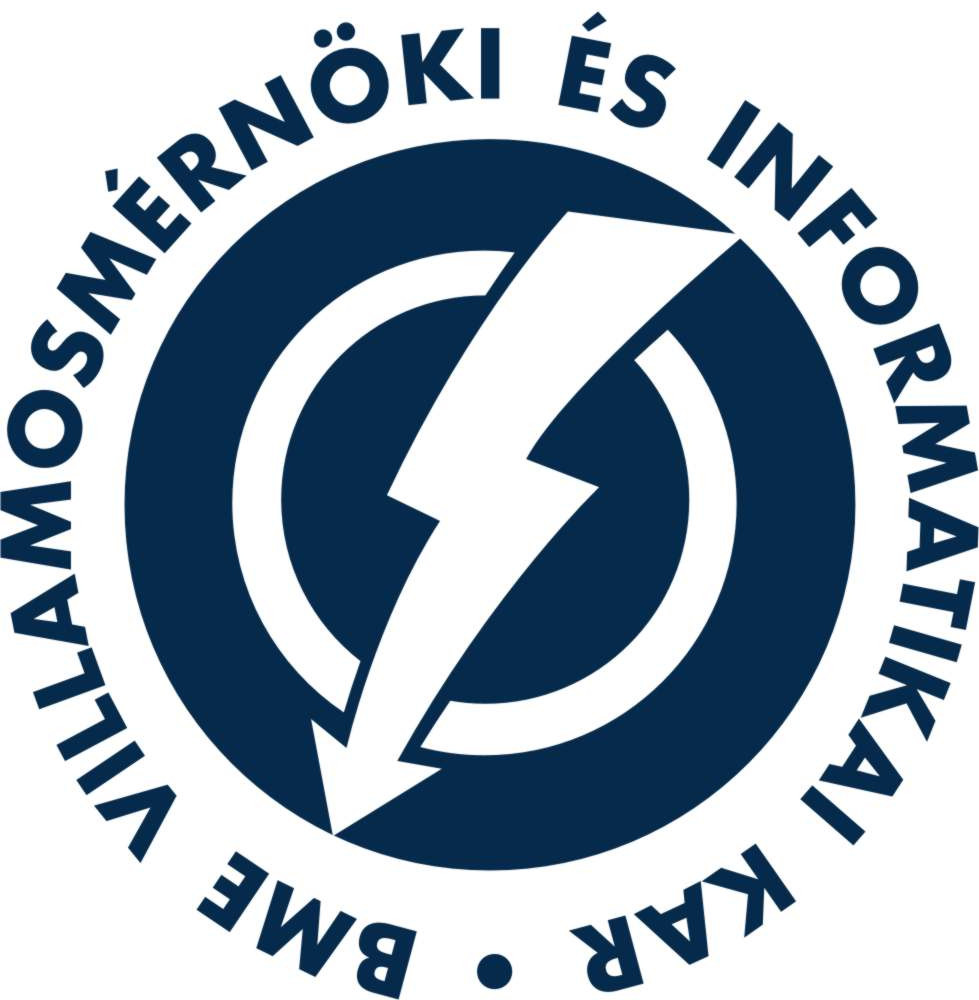

# 3D nyomtatáshoz külső alátámasztás generálása

## Készült





### [Budapesti Műszaki és Gazdaságtudományi Egyetem](https://www.bme.hu)
### [Villamosmérnöki és Informatikai Kar](https://www.vik.bme.hu)
### [Irányítástechnika és Informatika Tanszék](https://www.iit.bme.hu)
Témalaboratórium 2023/2024-1

Önálló laboratórium 2023/2024-2

keretei között.

## Készítette
Erős Pál mérnökinformatikus BSc hallgató

Konzulens: Dr. Salvi Péter

## Feladat

A 3D nyomtatás világa mindig is vonzott. Izgalmas dolog, amikor akár otthoni körülmények
között is szinte bármilyen háromdimenziós alakzatot létre lehet hozni. Szerettem volna
olyan témát választani, ami nem csak egy elméleti dolog, hanem a gyakorlatban is alkalmaz-
ható és akár valamilyen szinten látványos is. Így esett a választásom erre a projektre, amely
a 3D nyomtatáshoz alátámasztásokkal foglalkozik. A 3D nyomtatás során a nyomtatók nem
tudnak levegőben nyomtatni, illetve bizonyos meredekség esetén sem tudja megtartani
magát az alakzat a nyomtatás folyamán. Ennek a problémának az orvoslására szolgálnak
az alátámasztások, amelyek szintén nyomtatott alakzatok és a szerepük az,
hogy a nyomtatás során az új rétegnek legyen mire támaszkodnia. A feladat során nem
volt cél, hogy egy teljesen új algoritmust dolgozzak ki, vagy hogy hibátlanul működjön
a gyakorlatban bármilyen modellen. Ez azért jóval komolyabb feladat lett volna. Azt
szerettük volna elérni, hogy egy 3D modellre a program kiszámolja azokat a pontokat,
amiket alá kellene támaszani egy éles nyomtatás során. Ezt követően a programunk le is generálja 
az alátámasztásokat, melyek "oszlop" vagy "fa" formájában jelennek meg a modell alatt.

## Beszámoló
A Témalaboratórium tantárgyra készített projekt beszámolója [itt](ErosPal_BTMLYV_TemalabBeszam.pdf) található.

## Használat
A main.cpp fájlban a következő sorokat kell módosítani:
```cpp
/**
 * Az alatamasztas tipusanak beallitasa
 */
#define COLUMN_SUPPORT /// Oszlop alatamasztas
//#define TREE_SUPPORT /// Fa alatamasztas


/**
 * A demozhato alakzatok
 * FONTOS: csak akkor mukodik, ha az alakzat haromszogekbol epul fel!
 */
#define TEST_BUNNY
//#define TEST_DIAMOND
//#define TEST_SPHERE
//#define TEST_LUCY
```
## Demó
Lehetőség van demózni a programot. A demózható alakzatok a következők:
* Nyuszi (Bunny)
* Gyémánt (Diamond)
* Gömb (Sphere)
* Angyal-szobor (Lucy)

## Felépítés
A projekt három fő részből áll.
1. A 3D modell beolvasása és az alátámasztandó pontok kiszámítása
   * supportPoints.cpp
   * supportPoints.h
2. Az oszlopok generálása
   * columnMain.cpp
   * columnMain.h
   * columnAuxiliary.cpp
   * columnAuxiliary.h
3. A fák generálása
   * treeMain.cpp
   * treeMain.h
   * treeAuxiliary.cpp
   * treeAuxiliary.h
4. Az egyéb kiegészítő fájlok
    * main.cpp
    * auxiliary.cpp
    * auxiliary.h
5. A modellek
    * models/
    * output/

## Dokumentáció
A forráskód dokumentációja és a megoldás lépései megtalálhatóak a fájlokban.